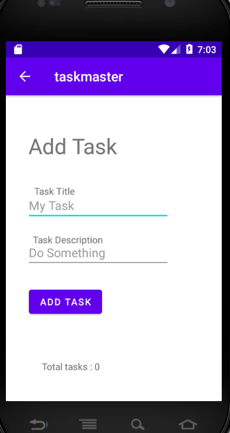
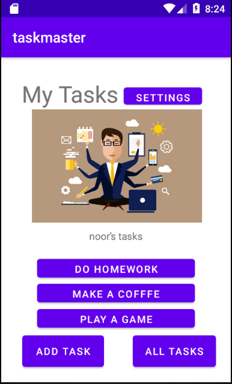
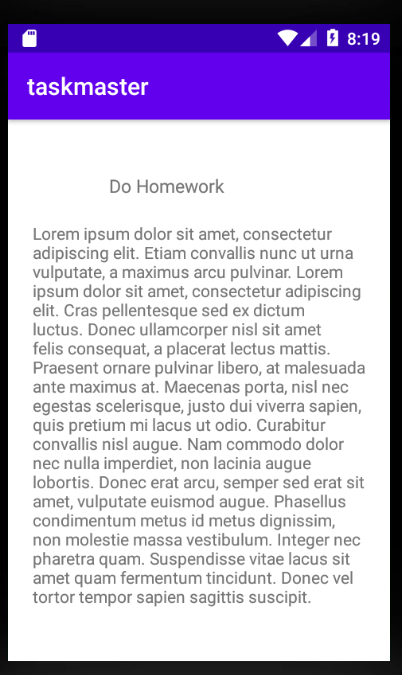
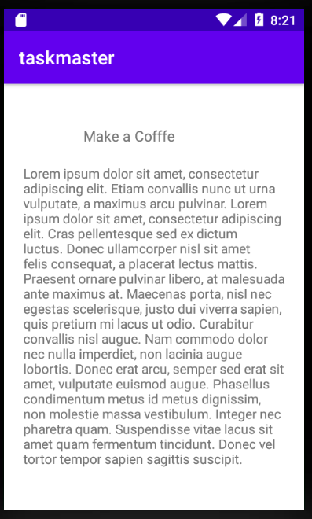
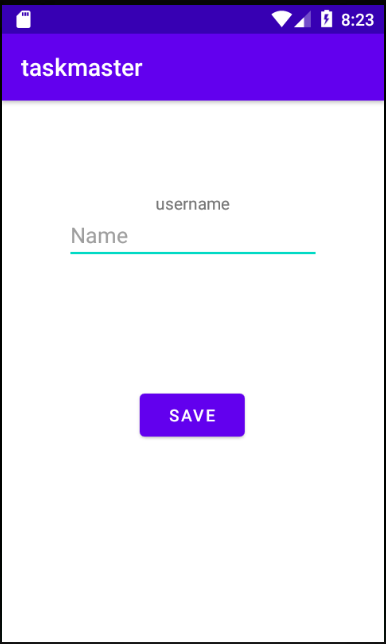
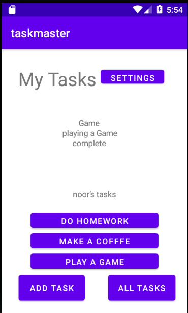
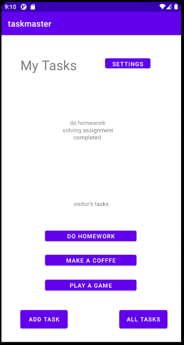
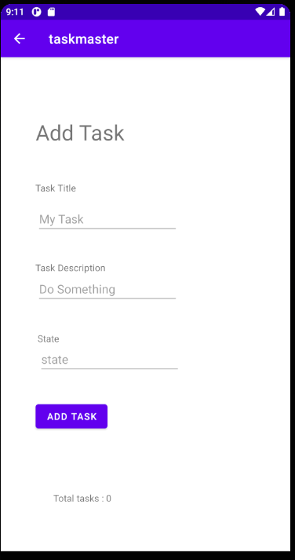
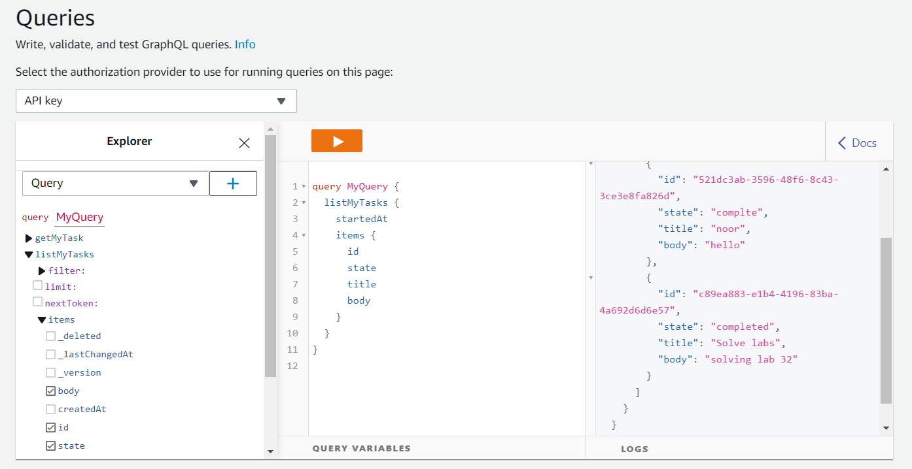

# lab 26

**Homepage**

 it  has a heading at the top of the page, an image to mock the “my tasks” view, and buttons at the bottom of the page to allow going to the “add tasks” and “all tasks” page.

 ## This is the home page

 

**Add a Task**

On the “Add a Task” page, allow users to type in details about a new task, specifically a title and a body. When users click the “submit” button, show a “submitted!” label on the page.

## This is the all Tasks page

 

**All Tasks**

The all tasks page has just an image with a back button.

## This is the Add task page

## lab 27

# Modefied Home page 
It has a three extra buttons and thay navigate the user to detail page , and setting button and it naviate the user to settings page .
 

## The Detail Page
 It has a title at the top of the page, and a Lorem Ipsum description.
  

## Settings Page
 It allows users to enter their username and hit save.
  

# lab 28

# Modefied Home page 
It has a Recycler view that dislay the data on it  .
 

# lab 29

The data is got from the form and saving it on the database and then get it from data base and render it on the home page instead of having them as a hard code .

# lab 31

It Is added  UI tests for taskmaster application, and polish for remaining feature tasks from previous labs.

its include tests for views displayed on the pages ,  tests for textView content , and some tests for moving between pages .

# lab 32

**Add Task Form**  

add task functionality Modified to save the data entered in as a Task to graphQL.  
(No changes in UI) 

**Homepage**  

homepage’s RecyclerView refactored to display all Task entities in graphQL. 
(No changes in UI) 

here is my queries in the cloud 

# lab 33

Feature Tasks 
Tasks Are Owned By Teams 
Create a second entity for a team, which has a name and a list of tasks. Update your tasks to be owned by a  team. 

Manually created three teams by running a mutation exactly three times in your code. (You do NOT need to allow  the user to create new teams.) 

Add Task Form 
Modify your Add Task form to include either a Spinner or Radio Buttons for which team that task belongs to. 

Settings Page 
In addition to a username, allow the user to choose their team on the Settings page. Use that Team to display  only that team’s tasks on the homepage. 

# Lab: 42 - Location

Location
When the user adds a task, their location should be retrieved and included as part of the saved Task.

Displaying Location
On the Task Detail activity, the location of a Task should be displayed if it exists.