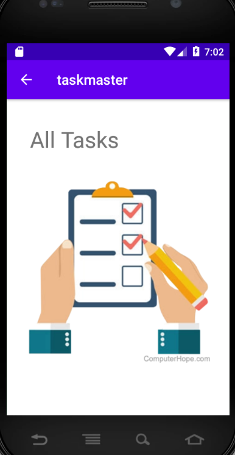

**Homepage**

 it  has a heading at the top of the page, an image to mock the “my tasks” view, and buttons at the bottom of the page to allow going to the “add tasks” and “all tasks” page.

 ## This is the home page

 

**Add a Task**

On the “Add a Task” page, allow users to type in details about a new task, specifically a title and a body. When users click the “submit” button, show a “submitted!” label on the page.

## This is the all Tasks page

 

**All Tasks**

The all tasks page has just an image with a back button.

## This is the Add task page

