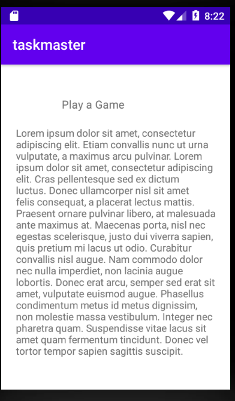

# lab 26

**Homepage**

 it  has a heading at the top of the page, an image to mock the “my tasks” view, and buttons at the bottom of the page to allow going to the “add tasks” and “all tasks” page.

 ## This is the home page

 

**Add a Task**

On the “Add a Task” page, allow users to type in details about a new task, specifically a title and a body. When users click the “submit” button, show a “submitted!” label on the page.

## This is the all Tasks page

 

**All Tasks**

The all tasks page has just an image with a back button.

## This is the Add task page

## lab 27

# Modefied Home page 
It has a three extra buttons and thay navigate the user to detail page , and setting button and it naviate the user to settings page .
 

## The Detail Page
 It has a title at the top of the page, and a Lorem Ipsum description.
  

## Settings Page
 It allows users to enter their username and hit save.
  

# lab 28

# Modefied Home page 
It has a Recycler view that dislay the data on it  .
 

